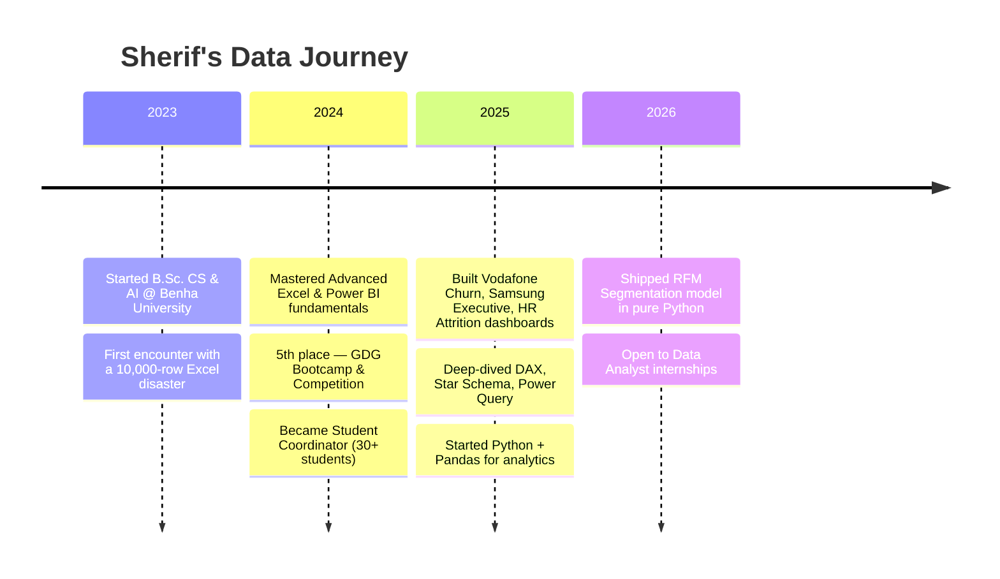

<!-- ═══════════════════════════════════════════════════════════
     SHERIF AYMAN · README.md · v4.0 — MARVEL EDITION
     Data Analyst | CS & AI Student | Benha University
     ═══════════════════════════════════════════════════════════ -->

<a name="top"></a>

<div align="center">


<a href="https://github.com/SherifAzb">
  
</a>

<p>
  <a href="https://linkedin.com/in/sherifazb"></a>
  
  
  
</p>

<p>
  <a href="#-origin-story">🦸 About</a> ·
  <a href="#-suit-specs--tech-arsenal">⚙️ Arsenal</a> ·
  <a href="#-mission-log--capstone-projects">📁 Missions</a> ·
  <a href="#-github-hud">📊 Stats</a> ·
  <a href="#-field-record">🏅 Achievements</a> ·
  <a href="#-contact-hq">📡 Contact</a>
</p>

</div>


## 🧪 Origin Story

> _"Every hero has an origin. Mine was a **10,000-row Excel sheet** full of nulls, broken date formats, and zero documentation — and I made it readable."_

Since then I've been on a single mission: **turn raw, chaotic data into insights that actually drive decisions.**
I went from cleaning that one sheet → to writing my own **RFM segmentation model in Python from scratch** — because eventually the dashboards weren't enough; I needed to understand what was happening *underneath* them.

Currently in my **3rd year** of **Computer Science & Artificial Intelligence** at **Benha University** (`GPA 3.7 / 4.00`), self-training across Python, Power BI, ETL, and data modeling — one industry-style project at a time.

```yaml
👤 name:       Sherif Ayman
🎯 role:       Data Analyst (in training)
🎓 education:  B.Sc. Computer Science & AI — Benha University (Expected 2028)
📊 gpa:        3.7 / 4.00
📍 location:   Benha, Egypt
🚀 status:     Open to Data Analyst internships (remote / hybrid / on-site)
🧠 stack:      Python · Power BI · DAX · SQL · Excel · Star Schema
🌍 languages:  Arabic (Native) · English (B2 Upper-Intermediate)
🎯 mission:    Make data make sense.
```


## ⚙️ Suit Specs — Tech Arsenal

<div align="center">


</div>

<table>
<tr>
<td width="25%" valign="top">

**📊 Visualization & BI**
- Power BI — DAX & Power Query
- Star Schema design
- Decomposition Trees
- Custom KPI cards & bookmarks
- Advanced Excel (Pivot, VLOOKUP, INDEX/MATCH)

</td>
<td width="25%" valign="top">

**🐍 Programming & Analysis**
- Python — Pandas, NumPy
- RFM & customer segmentation
- SQL — joins, CTEs, window fns
- C++ — OOP fundamentals
- Statistical & time-series analysis

</td>
<td width="25%" valign="top">

**🧹 Data Engineering**
- ETL pipeline design
- Data cleaning & wrangling
- Star schema modeling
- Exploratory Data Analysis
- Data quality auditing

</td>
<td width="25%" valign="top">

**🗣️ Soft Skills**
- Data storytelling
- Technical documentation
- Business requirements gathering
- Cross-functional collaboration
- Stakeholder communication

</td>
</tr>
</table>


## 📁 Mission Log — Capstone Projects

<table>
<tr>
<td width="50%" valign="top">

### 🎯 MISSION 001 · RFM Customer Segmentation
**`Python` `Pandas` `Segmentation`**

Built a Recency–Frequency–Monetary model **from scratch** in Python on an online-retail transaction dataset — no BI tool, just raw pandas logic.

**Impact:** Classified customers into actionable groups (Champions, At Risk, Hibernating) to power targeted retention & marketing strategy.

</td>
<td width="50%" valign="top">

### 📡 MISSION 002 · Vodafone Qatar — Churn Analysis
**`Power BI` `DAX` `Star Schema` `ETL`**

Cleaned unstructured raw datasets with Power Query and built a star-schema model to optimize dashboard performance.

**Impact:** Identified a **26.5% churn rate** and the key drop-off drivers, enabling a targeted retention strategy for executive stakeholders.

</td>
</tr>
<tr>
<td width="50%" valign="top">

### 📱 MISSION 003 · Samsung — Executive Dashboard
**`Power BI` `DAX` `Supply Chain`**

Built an executive Power BI report tracking **$176.95M** in revenue (FY 2023–2024) across regions and product categories.

**Impact:** Star schema + custom DAX measures (Total Sales, Unit Margin %, Top-Selling Series) surfaced supply-chain and inventory insights for leadership.

</td>
<td width="50%" valign="top">

### 🧑‍💼 MISSION 004 · HR Attrition — Workforce Risk
**`Power BI` `Star Schema` `DAX`**

Analyzed attrition patterns across **1,470 employees**, identifying a **16.12% attrition rate** and its key drivers.

**Impact:** Delivered HR stakeholders a clear, interactive view of workforce risk to inform retention policy.

</td>
</tr>
<tr>
<td width="50%" valign="top">

### 🏦 MISSION 005 · Banque Misr — Financial Patterns
**`EDA` `Power BI` `Excel`**

Performed EDA on large-scale banking datasets — surfaced customer behavioral trends and simplified complex financial data into dashboards for non-technical stakeholders.

</td>
<td width="50%" valign="top">

### 🌐 MISSION 006 · Portfolio Series
**`Power BI` `Time-Series` `Geo-Mapping`**

⚽ FIFA World Cup 2026 · 🚕 Uber Rides · 🚗 Automotive Sales · 📱 Teen Mental Health & Social Media

Self-driven analytics projects covering sports performance, ride-sharing demand, automotive sales, and social behavior.

</td>
</tr>
</table>

<div align="center">

[](https://sherifazb.github.io/)

</div>


## 🗺️ The Journey So Far




## 📊 GitHub HUD

<div align="center">


</div>


## 🏅 Field Record

| 🎖️ | Mission | Result |
|:--:|:--|:--|
| 🥈 | **GDG Bootcamp & Competition — 2024** | 5th place finalist · delivered technical solutions under deadline pressure in a multidisciplinary team |
| 🎓 | **Student Coordinator (Volunteer)** — Benha University · 2024–Present | Managing oral-exam logistics for 30+ students · communication bridge between professors & students |
| 📈 | **Academic Performance** | Maintaining **GPA 3.7 / 4.00** while shipping industry-style analytics projects on the side |
| 🌍 | **Self-taught Data Stack** | Went from Excel novice → Python RFM model in <18 months |


## 🔭 Currently

<table>
<tr>
<td width="33%" valign="top">

### 🌱 Learning
- Advanced SQL — window functions, CTEs
- Machine Learning fundamentals
- Statistical modeling (regression, clustering)

</td>
<td width="33%" valign="top">

### 🛠️ Building
- Portfolio v2 (Marvel-themed)
- End-to-end analytics case studies
- Reusable Power BI templates

</td>
<td width="33%" valign="top">

### 💬 Ask me about
- Building star schemas that don't fall apart
- Writing DAX that other people can actually read
- Turning a messy Excel into a story

</td>
</tr>
</table>


## 📡 Contact HQ

<div align="center">

[](https://sherifazb.github.io/)
[](https://linkedin.com/in/sherifazb)
[](mailto:sherifaymanazb@gmail.com)
[](https://github.com/SherifAzb)
[](https://wa.me/201558032223)

**📬 Best way to reach me:** LinkedIn DM or email · usually respond within 24 hours.

<br/>

**⚡ "With great data comes great responsibility." ⚡**

Built with مجهود and way too much DAX · [Back to top ↑](#top)


</div>
